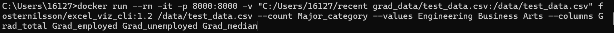

# Excel Viz CLI

## Introduction
Excel Viz CLI is a command-line interface (CLI) tool designed to transform data from CSV files into PNG graphs. Users can specify the path to a local CSV file and configure specific parameters. The resulting graph is accessible via a web browser at localhost:8000. Operating exclusively within a local Docker container, Excel Viz CLI ensures that your data remains secure and never exposed to the internet, maintaining privacy and integrity on your local machine.

## Prerequisites
Before using Excel Viz CLI, ensure you have the following installed on your system:
- **Docker**: Necessary for running the containerized version of the tool. For detailed instructions on installing Docker on Windows, please visit the [Docker Desktop for Windows installation guide](https://docs.docker.com/desktop/install/windows-install/).
- **Web Browser**: Required to view the generated graph on `localhost:8000`.

## Usage
1. **Pull the Docker Image**  
   Pull the latest version of Excel Viz CLI from Docker Hub using the following command:
   ```bash
   docker pull fosternilsson/excel_viz_cli:1.2

2. **Run Docker Container**  
   To use the tool, run the following command in your terminal. Replace `full/path/to/file_name.csv` with the actual path to your CSV file.
   ```bash
    docker run --rm -it -p 8000:8000 -v "full/path/to/file_name.csv:/data/file_name.csv" fosternilsson/excel_viz_cli:1.2 /data/file_name.csv --count <column> --values <rows in column> --columns <other columns to specify>

## Parameters Explained
- `--count` : Specifies the name of the column to perform a count aggregation on.
- `--values` : Determines which rows from the specified column will appear on the x-axis of the graph.
- `--columns` : Other column names in the CSV whose values are to be counted and displayed.

## Viewing the Graph

After running the command, open your web browser and navigate to:
[http://localhost:8000](http://localhost:8000)

## Screen Shots
Here's an exmple command to pass:


